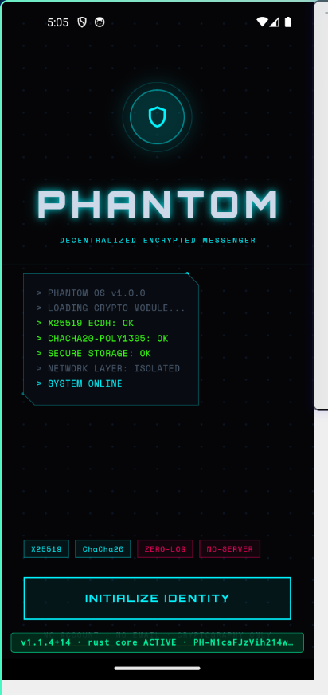
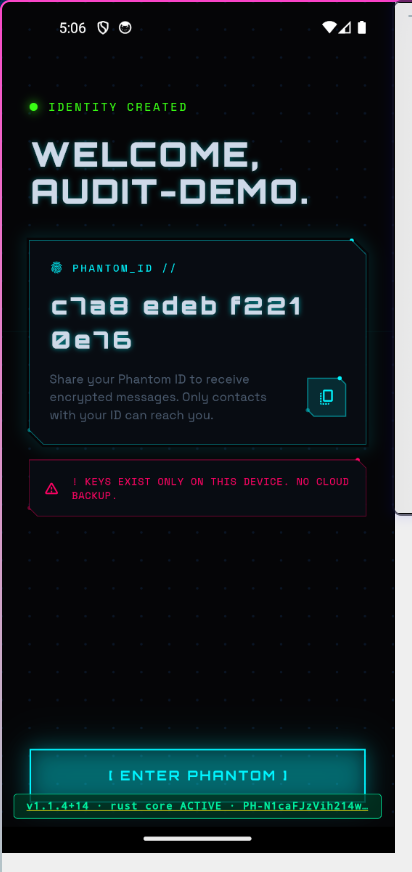
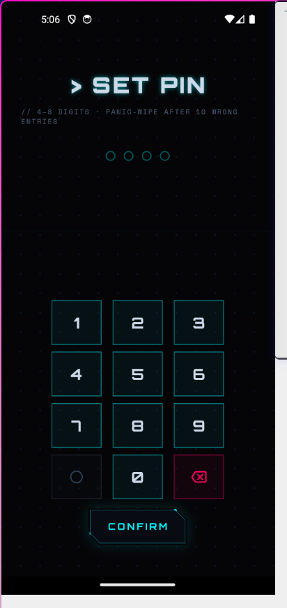
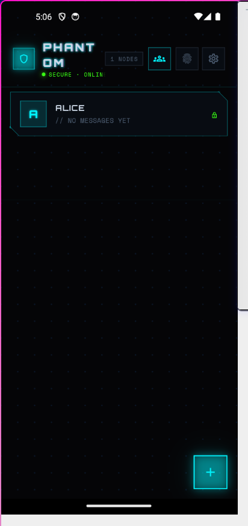
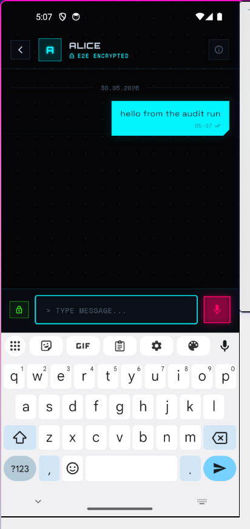
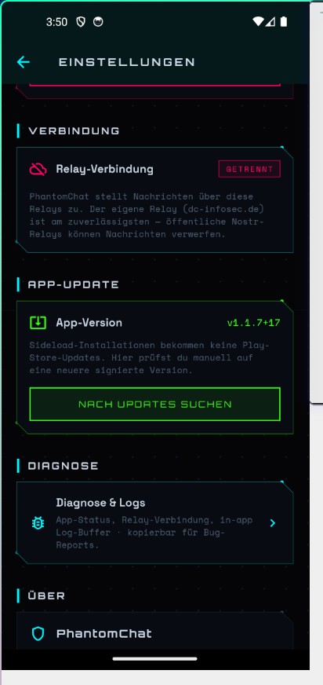

# PhantomChat

> **Dezentraler, Post-Quantum-sicherer, metadatenarmer Messenger.** Keine Telefonnummer, kein Account, kein zentraler Server. Monero-Style Stealth-Adressen + Double Ratchet + ML-KEM-1024 + MLS-Gruppen — verpackt in ein Envelope-Format, das sich auf dem Wire nicht von Cover Traffic unterscheiden lässt. Rust-Core, Flutter-Android-App, Tauri-Desktop, headless CLI. Von **DC INFOSEC** ([dc-infosec.de](https://dc-infosec.de)).

[](https://github.com/cengo441337-a11y/phantomchat/actions/workflows/ci.yml)


> **⚠️ Forschungsprojekt, nicht extern auditiert.** Der Krypto-Stack ist spec-implementiert und test-abgedeckt (118 Tests + 30/30 Selftest), aber **noch nicht extern auditiert**. Für High-Stakes-Einsatz (Aktivismus, Whistleblowing, journalistische Quellenarbeit) bitte auf den Audit warten. Kein Ersatz für Signal/Briar/Cwtch in lebenskritischen Szenarien.

## 📥 Download

**Android (empfohlen, aktuell):** **[updates.dc-infosec.de/download](https://updates.dc-infosec.de/download/)** — signierte APK v1.1.7, Auto-Update eingebaut.
**Desktop (Windows):** v3.0.7 auf derselben Seite. *(v3.0.8 mit den aktuellen Crypto-Fixes ist im Release-Prozess.)*

## 📸 So sieht's aus

<table>
  <tr>
    <td><br/><sub>Onboarding — lokale Identität</sub></td>
    <td><br/><sub>Phantom-ID (keine Nummer)</sub></td>
    <td><br/><sub>PIN + Panic-Wipe</sub></td>
  </tr>
  <tr>
    <td><br/><sub>Kontakte (E2E)</sub></td>
    <td><br/><sub>Verschlüsselter Chat</sub></td>
    <td><br/><sub>Einstellungen + Update</sub></td>
  </tr>
</table>

## ✅ Was wirklich drin ist — und was (noch) nicht

| Feature | Status | Anmerkung |
|---|---|---|
| **Krypto-Core** (Envelope, Double Ratchet, PQXDH) | ✅ funktioniert | 118 Tests grün, Selftest 30/30 |
| **Post-Quantum** (ML-KEM-1024 + X25519 Hybrid) | ✅ funktioniert | Key-Exchange; Signaturen bleiben Ed25519 (klassisch) |
| **Monero-Style Stealth-Adressen** | ✅ funktioniert | Relay kann Empfänger nicht zuordnen |
| **MLS-Gruppen** (RFC 9420, openmls) | ✅ funktioniert | Ciphersuite klassisch (X25519+AES-128+Ed25519) |
| **Sender-Keys-Gruppen** (Signal-Style) | ✅ funktioniert | für kleinere Gruppen |
| **Android-App** (Flutter, v1.1.7) | ✅ läuft | signiert, Auto-Update, voll bedienbar |
| **Nachrichten-Zustellung** (über eigenen Relay) | ✅ funktioniert | `wss://relay.dc-infosec.de`, 24/7 |
| **Desktop-App** (Tauri 2, v3.0.7) | ✅ läuft | Code hat aktuelle Fixes; v3.0.8-Release pending |
| **CLI** (keygen/send/listen/group/file/selftest) | ✅ funktioniert | headless, scriptbar |
| **File-Transfer** (`.ptf`, SHA256-verifiziert) | ✅ funktioniert | byte-identischer Roundtrip getestet |
| **Onion-Mixnet, PSI, Dandelion++, Cover-Traffic** | ✅ implementiert | im Core + Selftest |
| **Tor-Stealth-Mode** (SOCKS5) | ✅ funktioniert | braucht lokalen Tor/Nym-Listener |
| **Zustellung über public Nostr-Relays** | 🟡 unzuverlässig | droppen die tag-losen Stealth-Events → eigener Relay nötig (ist Default) |
| **Desktop Auto-Update** | 🟡 in Arbeit | funktioniert erst wenn v3.0.8 released ist |
| **Update-Manifest-Signatur** (Ed25519) | 🟡 Infrastruktur da | Signing-Key noch nicht generiert (HTTPS+SHA256+VersionCode greifen) |
| **Externer Krypto-Audit** | ❌ ausstehend | für High-Stakes-Einsatz abwarten |
| **iOS-App** | ❌ nicht gebaut | braucht Apple Developer Account |
| **Voice→Text (STT, on-device)** | 🟡 Code da | hinter `stt`-Feature, in Release-Builds aus |

---

## Quick Start

```bash
# Build
cargo build --release -p phantomchat_cli

# Pipeline self-test — 30 checks across 9 phases in one process,
# no network required
./target/release/phantomchat_cli selftest

# Generate an identity + view the shareable address
./target/release/phantomchat_cli keygen -o alice.json
./target/release/phantomchat_cli pair   -f alice.json

# Send an encrypted message (classic or PQXDH hybrid, auto-detected from
# the recipient address; the `phantom:` vs `phantomx:` prefix decides).
# Default relay is the project's own broadcast relay — public Nostr relays
# drop PhantomChat's tag-less stealth events.
./target/release/phantomchat_cli send \
  -f alice.json \
  -r "phantom:<view_hex>:<spend_hex>" \
  -m "first ghost message" \
  -u wss://relay.dc-infosec.de

# Listen for incoming envelopes (view-key stealth-scanning against every
# envelope the relay broadcasts)
./target/release/phantomchat_cli listen -f alice.json -u wss://relay.dc-infosec.de

# Switch to MaximumStealth (requires a local Tor / Nym SOCKS5 listener)
./target/release/phantomchat_cli mode stealth --proxy 127.0.0.1:9050
```

The full test suite runs without a network:

```bash
cargo test -p phantomchat_core --no-default-features --features net,mls
# 118 tests across envelope, scanner, pow, ratchet (incl. replay /
# out-of-order / cross-version regression tests), session, sealed sender,
# hybrid PQXDH, fingerprint, prekey, group (Sender Keys), mixnet, PSI, MLS
```

---

## Der Countdown läuft. Der Unsichtbare ist in der Matrix.

Die meisten Messenger versprechen dir Ende-zu-Ende-Verschlüsselung. Sie sagen dir, dass niemand deine Nachrichten lesen kann. Was sie dir nicht sagen: Sie wissen ganz genau, **wann du online bist, von wo du sendest und mit wem du sprichst.**

WhatsApp, Telegram, Signal — alle speichern Metadaten. Sie kennen deine Telefonnummer. Sie haben zentrale Server, die abgeschaltet, zensiert oder gehackt werden können. Verschlüsselter Inhalt nützt dir wenig, wenn das Muster deiner Kommunikation dich schon längst verraten hat.

**PhantomChat löst das Problem an der Wurzel. Nicht nur der Inhalt ist unsichtbar — die Kommunikation selbst hinterlässt keine Spuren.**

---

## Was PhantomChat anders macht

### Keine Identität. Kein Account. Kein Problem.

Du lädst die App herunter und bist drin. Keine Telefonnummer, keine E-Mail, kein Name, keine SIM-Karte. Deine Identität ist ein kryptografisches Schlüsselpaar — generiert lokal auf deinem Gerät, niemals ein Server berührt es. Du bist ein anonymer Schatten im Netz, und das ist Absicht.

### Post-Quantum gesichert — ab Tag 1

Elliptische Kurven allein sind nicht zukunftssicher. Shor's Algorithmus auf einem Quantencomputer bricht X25519 in Sekundenbruchteilen. PhantomChat nutzt **PQXDH**: eine hybride Schlüsselkapselung aus **ML-KEM-1024** (Kyber, FIPS 203 — der offizielle NIST-Standard) kombiniert mit X25519. Der Session-Key ist `SHA256(x25519_shared || mlkem_shared)` — beide müssen gleichzeitig gebrochen werden. Kein Quantencomputer der nächsten Jahrzehnte schafft das.

Double Ratchet Forward Secrecy ist selbstverständlich. Jede Nachricht rotiert den Key. Frühere Nachrichten bleiben auch bei zukünftiger Kompromittierung sicher.

### Der blinde Postbote — Zero-Metadata via ViewKey-Scanning

Das ist das Kernstück. Wo andere Messenger dem Relay verraten, *für wen* eine Nachricht ist (NIP-04/59-Schwächen leaken Empfänger-Korrelation), geht PhantomChat einen anderen Weg:

**Das Relay weiß niemals, wer der Empfänger einer Nachricht ist.**

Alle Envelopes sehen für das Relay identisch aus — undifferenziertes Rauschen. Der Client läuft lokal einen **Stealth-Scanner** über den gesamten Event-Stream. Mit seinem privaten ViewKey identifiziert er seine eigenen Nachrichten via ECDH + HKDF + HMAC. Das Relay ist strukturell blind gegenüber Sender-Empfänger-Korrelationen — nicht weil wir es bitten, nichts zu loggen, sondern weil es die Information physisch nicht hat.

Das Modell ist direkt vom Monero-Stealth-Address-System inspiriert. Bewährt in der Praxis, mathematisch verifizierbar.

### Dandelion++ — Deine IP existiert nicht

Bevor eine Nachricht im Netzwerk auftaucht, durchläuft sie das **Dandelion++ Protokoll**: In der Stem-Phase wird sie mit Wahrscheinlichkeit p=0,9 an genau einen zufällig gewählten Peer weitergeleitet — ohne Broadcast. Erst nach dem stochastischen Übergang folgt die Fluff-Phase (GossipSub-Broadcast). Der Stem-Peer rotiert alle 10 Minuten.

Ein Netzwerk-Beobachter sieht einen Broadcaster, der mehrere Hops vom wahren Absender entfernt ist. Deine IP ist aus dem Graphen nicht mehr zurückverfolgbar.

### Cover Traffic — Timing-Angriffe ausgehebelt

PhantomChat sendet kontinuierlich Dummy-Envelopes — CSPRNG-befüllt, auf dem Wire von echten Nachrichten nicht zu unterscheiden. Kein Angreifer kann durch Traffic-Timing-Analyse erkennen, wann du wirklich eine Nachricht sendest.

- **Daily Use Mode:** 30–180 Sekunden Zufallsintervall
- **Maximum Stealth Mode:** 5–15 Sekunden — aggressiv, lückenlos

### Der Paranoia-Schalter — Maximum Stealth Mode

Ein Klick in den Einstellungen. Ab diesem Moment:

- libp2p vollständig deaktiviert — kein direktes Peer-Exposure
- Alle Nostr-WebSocket-Verbindungen tunneln durch **SOCKS5** (Tor oder Nym)
- Das Relay sieht nur die Exit-IP des Anonymisierungsnetzes — niemals deine
- Cover Traffic läuft auf Aggressiv-Modus
- Schutz gegen **globale passive Angreifer** — das Bedrohungsmodell des Geheimdienstes

### Unabschaltbar — Echtes Serverless

PhantomChat nutzt kein zentrales AWS-Cluster, keine "DAO-gesteuerten" Netzwerke, deren Dezentralisierung niemand prüfen kann. Der Netzwerk-Stack ist hybrid:

- **libp2p GossipSub** — direktes P2P-Mesh, Kademlia-DHT, selbstheilend
- **Nostr-Relays** — offenes Protokoll (NIP-01), jeder kann einen Relay betreiben
- Fällt ein Node aus, heilt das Netzwerk im Hintergrund selbst

Solange zwei Geräte existieren, lebt das Netzwerk.

### Sybil-Resistance by Math

Jeder Envelope enthält einen **Hashcash Proof-of-Work**. Spam und Sybil-Angriffe kosten Rechenzeit. Keine zentrale Registrierung, kein Captcha — nur Mathematik.

---

## Für alle, die "Trust me bro" nicht als Krypto-Konzept akzeptieren

Ein Hinweis zur Branche: Während Mitbewerber stolz mit Begriffen wie "Individual Adaptive Encryption" und "AES 512" werfen — was jedem, der FIPS 197 gelesen hat, ein müdes Lächeln abringt, da 512-Bit-AES schlicht nicht existiert — setzen wir auf offene, überprüfbare NIST-Standards. Sicherheit entsteht nicht durch das Fantasieren über nicht existierende Schlüssellängen. Sie entsteht durch mathematisch fundierte Protokolle, die jeder prüfen kann.

**PhantomChat liefert Krypto statt Marketing-Esoterik.**

Der gesamte Krypto-Stack ist offen, dokumentiert und verifizierbar:

```
XChaCha20-Poly1305   AEAD Payload-Verschlüsselung
HKDF-SHA256          Schlüsselableitung aus ECDH
X25519               Ephemeral Diffie-Hellman
ML-KEM-1024          Post-Quantum Key Encapsulation (FIPS 203)
HMAC-SHA256          Stealth-Tags für Empfänger-Identifikation
secp256k1 Schnorr    Nostr Event-Signierung (NIP-01)
SQLCipher AES-256    Lokale Datenbankversclüsselung
```

---

## Feature Matrix

| Feature | Status |
|---------|--------|
| XChaCha20-Poly1305 AEAD | ✓ |
| X25519 Ephemeral ECDH + HKDF-SHA256 | ✓ |
| HMAC Stealth-Tags (Monero-Modell) | ✓ |
| ViewKey-basierter Envelope-Scanner | ✓ |
| Post-Quantum PQXDH (ML-KEM-1024 + X25519) | ✓ |
| Double Ratchet Forward Secrecy | ✓ (Envelope-Layer) |
| Dandelion++ IP-Anonymisierung | ✓ |
| libp2p GossipSub P2P Mesh | ✓ |
| Nostr Relay Transport (NIP-01 / Kind 1059) | ✓ |
| StealthNostrRelay (SOCKS5 → TLS → WebSocket) | ✓ |
| Cover Traffic (Light 30–180 s / Aggressive 5–15 s) | ✓ |
| Daily Use / Maximum Stealth Mode | ✓ |
| Hashcash Proof-of-Work | ✓ |
| SQLCipher lokale Verschlüsselung | ✓ |
| Panic Wipe | ✓ |
| Flutter Mobile App (Android — iOS deferred) | ✓ |
| Mobile App-Lock (PIN PBKDF2 600k + Biometrie + Panic-Wipe) | ✓ |
| Mobile Voice-Messages (Wave 11B — record + send + playback) | ✓ |
| Mobile In-App APK Auto-Update (Wave 11G — signed manifest + banner) | ✓ |
| Cyberpunk CLI | ✓ |
| Post-Quantum Hybrid vollständig (ML-KEM / Kyber im Envelope-Flow) | ✓ |
| App-Lock PIN (PBKDF2) + Biometrie + Panic-Wipe | ✓ |
| Core integration-test suite (64 tests) | ✓ |
| CLI selftest (30 Checks · 9 Phasen) | ✓ |
| Tor SOCKS5 Stealth-Routing live | ✓ |
| Systemd Dauer-Listener | ✓ |
| **Sealed Sender** (Ed25519 identity-level message attribution) | ✓ |
| **Payload Padding** (1024-byte blocks, gegen Length-Korrelation) | ✓ |
| **Safety Numbers** (60-Digit Signal-style Fingerprint gegen MITM) | ✓ |
| **X3DH Prekey Bundle** (SignedPrekey + OPK + Bundle-Sig-Chain) | ✓ |
| **Gruppenchat via Sender Keys** (Signal-Stil, Ed25519-signiert) | ✓ |
| **Onion-Mixnet** (Sphinx-style layered AEAD, N-Hop Routing) | ✓ |
| **PSI Contact Discovery** (DDH-Ristretto, no-leakage) | ✓ |
| **WASM Browser-Bindings** (wasm-bindgen für JS-Client) | ✓ |
| **MLS Gruppen** (RFC 9420 via openmls 0.8, TreeKEM) | ✓ |
| **Tauri 2 Desktop App** (Windows MSI · React + Tailwind · cyberpunk UI) | ✓ |
| **MLS-over-Relay Auto-Transport** (MLS-WLC2 + MLS-APP1 prefix wrapping) | ✓ |
| **MLS persistente Storage** (file-backed openmls, gruppen überleben Neustart) | ✓ |
| **MLS Lifecycle** (leave / list_members / remove_member) | ✓ |
| **Multi-Relay Subscription** (3 default · SHA256-Dedupe LRU 4096) | ✓ |
| **Auto-Reconnect** (Exp-Backoff jitter, max 60 s, attempt-counter Reset) | ✓ |
| **Read Receipts** (✓ sent / ✓✓ delivered / ✓✓ read · IntersectionObserver auto-mark) | ✓ |
| **Typing Indicators** (TYPN-1: prefix · 1.5 s throttle · 5 s TTL decay) | ✓ |
| **System Tray + Native Notifications** (focus-aware · click-to-restore) | ✓ |
| **5-Step Onboarding Wizard** (welcome → identity → relays → QR → done) | ✓ |
| **Settings Panel** (Identity QR · Privacy/Tor · Relays · Audit · Wipe-Confirm) | ✓ |
| **Audit Log** (JSONL append-only · ISO27001/ISMS-friendly · Export-Path) | ✓ |
| **i18n DE + EN** (react-i18next · ~230 keys · formal "Sie" · auto-locale) | ✓ |
| **Auto-Updater** (Tauri Updater · Ed25519-signed · `updates.dc-infosec.de`) | ✓ |
| **File Transfer 1:1** (FILE1:01 prefix · 5 MiB cap · sha256-verify · paperclip + drag-drop) | ✓ |
| **Message Search** (Ctrl+F · debounced · sender filter · scroll-to-row pulse) | ✓ |
| **Visual Polish** (CRT scanlines · Pane glow · Glitch on tampered · Orbitron headers) | ✓ |
| **AI Bridge** (Wave 11A/C/D/E/F — Home-LLM als virtueller Kontakt, ClaudeCli/Ollama/Anthropic/OpenAI, on-device whisper.cpp STT, proaktive Cron-Watchers) | ✓ |
| **Signed Windows MSI** (Wave 10 — Authenticode + RFC 3161 timestamp via `scripts/sign-windows.cmd`) | ✓ |
| Externer Krypto-Audit | Vor Produktion |

---

## Architektur

```
┌──────────────────────────────────────────────────────────┐
│                   Flutter Mobile App                      │
│         Cyberpunk UI · Privacy Settings · Scanner        │
└────────────────────────┬─────────────────────────────────┘
                         │ flutter_rust_bridge (sync + async)
┌────────────────────────▼─────────────────────────────────┐
│                 phantomchat_core  (Rust)                  │
│                                                           │
│  Envelope (XChaCha20 · HKDF · X25519 · ML-KEM-1024)     │
│  ViewKey Scanner · Dandelion++ Router · PoW              │
│  Privacy Config · Cover Traffic Generator                │
│  libp2p GossipSub Network                                │
└────────────┬──────────────────────────┬──────────────────┘
             │                          │
  ┌──────────▼──────────┐   ┌───────────▼──────────────────┐
  │  libp2p GossipSub   │   │     phantomchat_relays        │
  │  + Dandelion++      │   │                               │
  │                     │   │  NostrRelay     (TLS/WS)      │
  │  [Daily Use]        │   │  StealthRelay   (SOCKS5→Tor)  │
  └─────────────────────┘   └──────────────────────────────┘

Daily Use:      libp2p P2P  +  Nostr/TLS  +  Cover Traffic Light
Maximum Stealth: Relay-only  +  Tor/Nym   +  Cover Traffic Aggressive
```

---

## Cyberpunk CLI

```bash
# Keypair generieren
cargo run -p phantomchat_cli -- keygen

# Pairing-QR anzeigen (ASCII, scanbar)
cargo run -p phantomchat_cli -- pair

# Privacy Mode setzen
cargo run -p phantomchat_cli -- mode stealth --proxy 127.0.0.1:9050
cargo run -p phantomchat_cli -- mode stealth --nym
cargo run -p phantomchat_cli -- mode daily

# Nachricht senden (zeigt Dandelion++ Phase)
cargo run -p phantomchat_cli -- send -r <SPEND_PUB_HEX> -m "ghost protocol"

# Lauschen — alle Envelopes scannen, eigene öffnen
cargo run -p phantomchat_cli -- listen

# Relay Health-Check
cargo run -p phantomchat_cli -- relay -u wss://relay.damus.io

# Node Status
cargo run -p phantomchat_cli -- status
```

---

## Bedrohungsmodell

PhantomChat verteidigt gegen:

| Angreifer | Abwehr |
|-----------|--------|
| Passiver Global Observer (NSA-Modell) | Maximum Stealth + Tor + Aggressive Cover Traffic |
| Bösartige Relays | ViewKey-Modell — Relay hat keine Empfänger-Information |
| Traffic-Timing-Korrelation | Cover Traffic · Dandelion++ · SOCKS5 |
| Aktiver MITM / Key-Kompromittierung | Double Ratchet · Forward Secrecy · PQXDH |
| Quantencomputer (Shor) | ML-KEM-1024 Hybrid — beide Seiten müssen gleichzeitig brechen |
| Spam / Sybil-Angriffe | Hashcash PoW |
| Gerätekompromittierung | SQLCipher · Panic Wipe · PIN/Biometrie (geplant) |
| Filesystem-Diebstahl (gestohlenes Notebook) | OS-Keystore (DPAPI / Keychain / libsecret) statt Plaintext-`keys.json` — siehe [`desktop/README.md` § Key storage](desktop/README.md#key-storage-wave-8h--os-secure-keystore) |
| Memory-Dump (`gcore`, Hibernation-File) | `Zeroize`/`ZeroizeOnDrop` auf allen privaten Schlüsseltypen, `Zeroizing<Vec<u8>>` auf transienten Plaintext-Buffern |
| Forensische Recovery nach „Wipe All Data" | Pre-Delete Zero-Overwrite + `fsync` + Truncate für jede Datei ≤ 100 MiB im app-data-dir |

Vollständige Dokumentation: [docs/SECURITY.md](docs/SECURITY.md)

---

## Repository-Layout

```
phantomchat/
├── core/              Rust-Kernbibliothek — die gesamte Krypto lebt hier
│   ├── src/
│   │   ├── envelope.rs    Envelope (v1 classic, v2 PQXDH-hybrid)
│   │   ├── scanner.rs     ViewKey-Stealth-Scanner
│   │   ├── ratchet.rs     Signal-style Double Ratchet
│   │   ├── session.rs     SessionStore + send/receive/receive_full
│   │   ├── keys.rs        X25519, Ed25519, HybridKeyPair (ML-KEM-1024)
│   │   ├── address.rs     PhantomAddress + phantomx: extended form
│   │   ├── fingerprint.rs Safety Numbers (60-digit)
│   │   ├── prekey.rs      X3DH Prekey Bundle
│   │   ├── group.rs       Sender Keys group chat
│   │   ├── mls.rs         RFC 9420 MLS via openmls (`mls` feature)
│   │   ├── mixnet.rs      Sphinx-style layered onion routing
│   │   ├── psi.rs         DDH-Ristretto Private Set Intersection
│   │   ├── wasm.rs        wasm-bindgen JS surface (`wasm` feature)
│   │   ├── dandelion.rs   Dandelion++ router (native `net` feature)
│   │   ├── cover_traffic.rs  Light + Aggressive generators
│   │   ├── privacy.rs     PrivacyMode · ProxyConfig
│   │   ├── pow.rs         Hashcash PoW
│   │   ├── api.rs         Flutter-Bridge API (FRB · `ffi` feature)
│   │   └── network.rs     libp2p GossipSub bindings
│   └── tests/             9 integration-test suites, 64 tests
├── cli/               phantom — the cyberpunk CLI + TUI (`phantom chat`)
├── relays/            Nostr + SOCKS5 relay adapters (`MultiRelay` fan-out)
├── desktop/           Tauri 2 + React + Tailwind frontend
│   └── src-tauri/
│       └── src/
│           ├── lib.rs             Tauri commands + listener wiring
│           ├── ai_bridge.rs       Wave 11A/F — provider + per-contact routing
│           ├── ai_bridge_stt.rs   Wave 11D — whisper.cpp on-device transcription
│           └── ai_bridge_watchers.rs  Wave 11E — proactive cron watchers
├── mobile/            Flutter App (Android) via flutter_rust_bridge —
│                      voice messages (Wave 11B), in-app APK auto-update (Wave 11G)
├── tools/             Org MSI templater + automation helpers (Wave 7C)
├── fuzz/              `cargo-fuzz` harnesses for every wire-format parser
├── scripts/           build-android.sh · build-windows.cmd · sign-windows.cmd ·
│                      verify-release.sh · publish-android-update-manifest.sh
├── docs/              SECURITY.md · PRIVACY.md · AI-BRIDGE.md · WINDOWS-BUILD.md ·
│                      RELAY-SELFHOSTING.md · REPRODUCIBLE-BUILDS.md ·
│                      HALL-OF-FAME.md · archive/
├── keys/              security.asc (PGP disclosure key) ·
│                      phantomchat-pilot-cert.cer (Authenticode pilot, self-signed)
├── .well-known/       security.txt (RFC 9116, PGP-signed)
├── spec/              SPEC.md Protokollspezifikation
├── infra/             docker-compose.yml + systemd unit files
└── CHANGELOG.md
```

---

## Build-Matrix

| Ziel | Kommando | Hinweise |
|------|----------|----------|
| Classic CLI (`phantom`) | `cargo build --release -p phantomchat_cli` | Zieht `net` + `mls` per Default |
| Core ohne Network-Stack | `cargo test -p phantomchat_core --no-default-features` | Lean build, nur Krypto |
| Core mit MLS | `cargo test -p phantomchat_core --no-default-features --features mls` | openmls 0.8 transitive |
| Core für Browser | `RUSTFLAGS='--cfg getrandom_backend="wasm_js"' cargo build -p phantomchat_core --no-default-features --features wasm --target wasm32-unknown-unknown` | Dann `wasm-bindgen --target web --out-dir pkg` |
| Flutter Mobile | `cd mobile && flutter pub get && flutter run` | Nach FFI-Regen: `flutter_rust_bridge_codegen generate` |
| Dauer-Listener (systemd) | `infra/systemd/phantom-listener.service` | Startet nach `tor.service` |

---

## Self-Hosted Relay

Public relays (Damus, nos.lol, snort.social) are fine for most users —
PhantomChat envelopes look indistinguishable from cover-traffic at the
relay layer, so even a fully malicious operator learns nothing about
content or recipients.

Organisations with hard data-sovereignty requirements (Kanzleien,
Steuerberater, Behörden) can run their own Nostr relay so that even the
TCP-layer metadata never leaves infrastructure they control. The
walkthrough — `strfry` on Docker, nginx + Let's Encrypt in front,
PhantomChat client config, ops notes (backup, compaction, monitoring,
log retention) — lives at:

[**docs/RELAY-SELFHOSTING.md**](docs/RELAY-SELFHOSTING.md)

Quick teaser: ~30 minutes from a fresh VM to a working
`wss://relay.your-org.de`. The same doc also covers pointing the
(opt-in) crash-report uploader at your own collector endpoint instead of
`updates.dc-infosec.de`.

---

## Contributing

Pull Requests und Issues sind willkommen, besonders für:

- **Externer Krypto-Audit** — wenn du Kryptograph:in bist und PhantomChat auditieren willst, melde dich.
- **MLS-Migrationshelfer** — Sender-Keys → MLS Übergangs-Tooling für bestehende Gruppen.
- **Flutter UI-Port** von den `lib/src/ui/*` Dateien auf den echten Rust-FFI-Pfad (FFI-Bridge ist bereits live in `core/src/api.rs`).
- **Android APK Release-Signing + F-Droid Metadata**.
- **iOS Build + App-Store-Review** (braucht Apple-Developer-Account).

Code-Style: `cargo fmt` auf `core/` + `cli/` vor jedem Commit; `cargo clippy --all` sollte sauber laufen. Tests sind Pflicht für alle neuen Krypto-Pfade.

---

## CI/CD

PhantomChat ships three GitHub Actions workflows under `.github/workflows/`:

- **`ci.yml`** — runs on every push + PR: cargo build + selftest (`30/30`),
  `cargo test` on core (incl. `mls`), `cargo clippy -D warnings`, desktop
  TS/Vite build, Flutter analyze on touched dirs, and a 30-second smoke fuzz
  per parser target.
- **`release.yml`** — runs on `v*` tag-push: builds Tauri MSI on Windows,
  Flutter APK split-per-abi on Linux, CLI for 5 host triples, and
  publishes a GitHub Release with auto-generated changelog + SHA256SUMS.
- **`auto-deploy.yml`** — gated `workflow_dispatch` (will auto-trigger
  post-Release once trusted): SSHes to the Hostinger update host and runs
  `phantom-publish` for the MSI + scp's APKs to `/var/www/updates/download/`.

Dependabot bumps Cargo, npm, and GitHub Actions deps monthly, grouped per
ecosystem, with semver-major bumps ignored (see `.github/dependabot.yml`).

## Reproducible Builds

PhantomChat aims for byte-for-byte reproducible release artifacts so customers
can rebuild from the public Git tag and confirm the binary they downloaded
hasn't been tampered with. Full guide:
**[`docs/REPRODUCIBLE-BUILDS.md`](docs/REPRODUCIBLE-BUILDS.md)** — covers
pinned toolchains (Rust stable + Node 20 + Flutter `cc0734ac71` + NDK r26),
build steps for each artifact, and the `SOURCE_DATE_EPOCH` discipline.

The companion verifier downloads + hashes a published release in one shot:

```bash
bash scripts/verify-release.sh v3.0.0
# OK: all artifacts match published checksums.
```

## Fuzz Testing

Every wire-format parser in PhantomChat has a `cargo-fuzz` harness under
[`fuzz/`](fuzz/README.md): envelope, MLS-WLC2 / MLS-APP1, FILE1:01,
RCPT-1, TYPN-1, REPL-1, RACT-1, DISA-1, `PhantomAddress::parse`, and the
nostr-event extractor. CI smoke-fuzzes each target for 30 seconds on every
push; deeper runs are done out-of-band:

```bash
cargo +nightly fuzz run envelope_parse -- -max_total_time=300
```

A single panic in a parser is potentially RCE-adjacent — the harnesses
exist to make sure that never lands in `main`.

---

## License

Dual-Perspektive:

- **Code:** MIT — siehe [LICENSE](LICENSE).
- **Krypto-Claims:** PhantomChat ist **nicht extern auditiert**. Verlasse dich nicht auf diese Codebase für Hochrisiko-Kommunikation bis ein qualifizierter Auditor die Implementation freigegeben hat.

Sicherheitslücken bitte privat an **admin@dc-infosec.de** melden, nicht über öffentliche Issues — PGP-verschlüsselt mit dem Key in [`keys/security.asc`](keys/security.asc) (Fingerprint `0F8D A258 1B8A 1428 9F0F  2FD7 EF08 6D82 9914 A0E3`). Vollständige Disclosure-Policy + SLA + Safe-Harbor-Klausel: [`docs/SECURITY.md`](docs/SECURITY.md). Forschende-Anerkennung: [`docs/HALL-OF-FAME.md`](docs/HALL-OF-FAME.md).

---

*PhantomChat. Nicht nur verschlüsselt. Unsichtbar.*

---

© 2026 **DC INFOSEC** · [dc-infosec.de](https://dc-infosec.de)
